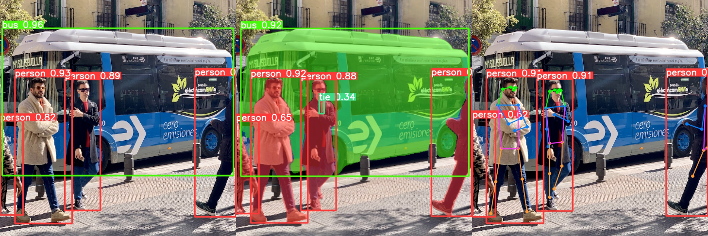

### yolov8不同任务中onnx的导出方法
- [使用yolov8官方库训练你自己的模型](https://github.com/ultralytics/ultralytics)
- 修改dynamic参数中对应的代码
```python
# 位置:ultralytics/yolo/engine/exporter.py中export_onnx函数，选择你要导出的任务，修改如下即可：
if dynamic:
    dynamic = {'images': {0: 'batch'}}  # shape(1,3,640,640)
    if isinstance(self.model, SegmentationModel):
        dynamic['output0'] = {0: 'batch'}
        dynamic['output1'] = {0: 'batch'}
    elif isinstance(self.model, DetectionModel):
        dynamic['output0'] = {0: 'batch'}

# 补充，注意导出yolov-pose任务的时候有个小bug(如果改过来就算了)，kpts_decode方法中:
if self.export:  # required for TFLite export to avoid 'PLACEHOLDER_FOR_GREATER_OP_CODES' bug
    y = kpts.view(bs, *self.kpt_shape, -1)
    a = (y[:, :, :2] * 2.0 + (self.anchors - 0.5)) * self.strides
    if ndim == 3:
        # a = torch.cat((a, y[:, :, 1:2].sigmoid()), 2) # 作者这里写错了，不应该是width的sigmoid
        a = torch.cat((a, y[:, :, 2:3].sigmoid()), 2) # 应该是score分支的sigmoid
    return a.view(bs, self.nk, -1)
```
- 然后使用下面的命令对yolov8的各任务模型进行导出即可，注意，默认的imgsz是640x640,这个根据你实际情况更改
```bash
yolo export \
    model=xxx_det_seg_pose.pt \
    imgsz=[640,640] \
    device=0 \
    format=onnx \
    opset=11 \
    dynamic=True \
    simplify=True
```
- yolov8检测分支导出onnx shape=[-1,box_num+cls_num,8400]，框维度在最后这就带来一个框内存不连续的问题，解决：
```bash
# 前言：yolov3/4/5/x/6/7人家都是[-1,8400,box_num+cls_num],你yolov8咋恁特立独行呢，干他，必须干他
# 使用assets/yolov8_onnx_trans.py直接转换最后一层layer的维度[detect,segment,pose都要转换]，就是将8400这个维度放到前面
```
### yolov8的onnx生成engine文件
- fp16量化生成的命令如下，这个精度损失不大，可以直接使用trtexec完成
```bash
trtexec --onnx=xxx_det_seg_pose_trans.onnx \
        --minShapes=images:1x3x640x640 \
        --maxShapes=images:16x3x640x640 \
        --optShapes=images:4x3x640x640 \
        --saveEngine=xxx_det_seg_pose_dynamic_fp16.engine \
        --avgRuns=100 \
        --fp16
```
- int8量化，这个直接用trtexec一般而言精度都有损失有的甚至无法工作，建议使用商汤ppq量化工具
  - [商汤的ppq的int8量化工具,支持tensorrt|openvino|mnn|ncnn|...](https://github.com/openppl-public/ppq)
  - [ppq不会使用的看yolov6的量化教程:](https://github.com/meituan/YOLOv6/tree/main/tools/quantization/ppq)

**生成Engine后直接编译运行即可，上面的代码都是经过测试的，如果出错请排查你的onnx或联系我解决**
- yolov8检测程序入口：mains/main_yolov8_det.cpp
- yolov8分割程序入口：mains/main_yolov8_seg.cpp
- yolov8姿态估计程序入口：mains/main_yolov8_pose.cpp

### 下面展示一下使用该项目的推理结果
